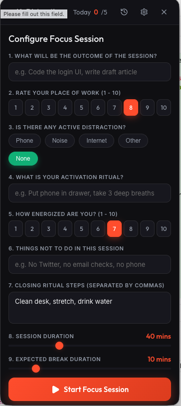
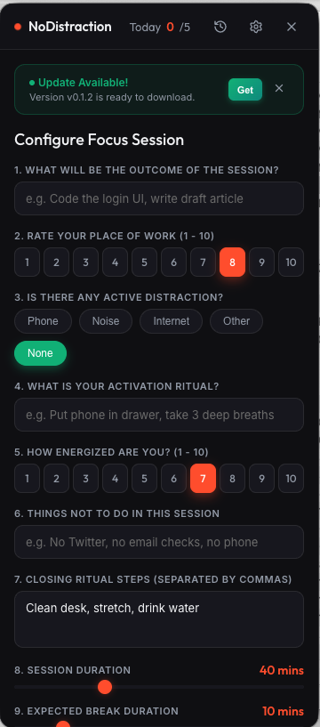

# NoDistraction 🎯

<p align="center">
  
  
</p>

A premium, distraction-free macOS menu bar Pomodoro focus timer that helps you run highly intentional, customizable work sessions and restful breaks.

Unlike traditional Pomodoro timers that enforce rigid 25-minute intervals, **NoDistraction** treats every session individually. You configure the target outcome, specify what *not* to do, choose a custom duration, and commit to an activation ritual before the clock starts ticking.

---

## Key Features

* **Status Bar Integration**: Hides completely from your macOS Dock. Lives quietly in your system menu bar as a red tiger icon.
* **Live Countdown Display**: Updates the macOS status bar text dynamically to show your remaining focus time (e.g. `39:49`) or break rest timer (e.g. `☕ 09:59`).
* **Intentional Setup (9 Questions)**: Forces mindfulness before starting by asking:
  1. What is the target outcome of this session?
  2. How do you rate your current place of work?
  3. Are there active distractions (Phone, Noise, Internet, etc.)?
  4. What is your activation ritual?
  5. How energized do you feel?
  6. Things NOT to do in this session.
  7. Closing ritual steps to finalize the session.
  8. Session duration in minutes.
  9. Expected break length.
* **Enforced Closing Checklist**: When the timer hits 0, a looping alarm sounds. The session cannot be completed until you tick off every checkbox in your closing ritual, helping you close loops cleanly.
* **Recharge Breaks**: Transitions automatically into a soothing break timer with randomized healthy physical, eye, and hydration rest tips.
* **Web Audio Synthesis**: Loop-alerts synthesized natively via Web Audio API (Zen Bell, Crystal Chime, and Digital Beep)—no heavy media files needed.
* **History Logs & Settings Drawer**: Expandable side panels to review past session statistics (energy ratings, distractions, task success) and configure daily session targets.

---

## Installation & Setup

1. Download the latest installer DMG from the **[GitHub Releases Page](https://github.com/MahtabTanim/NoDistraction/releases)** (or download the latest release directly via **[this static link](https://github.com/MahtabTanim/NoDistraction/releases/latest/download/NoDistraction-0.0.0-arm64.dmg)**).
2. Double-click the `.dmg` file and drag **NoDistraction** to your **Applications** folder.

### macOS Security / Gatekeeper Note
Because this app is free and open-source, it is not code-signed with a paid Apple Developer certificate. When you run it for the first time, macOS might display a warning saying *"NoDistraction is damaged and can't be opened"* or block it as an unsigned app.

To unblock the app, run this command in your **Terminal**:
```bash
xattr -cr /Applications/NoDistraction.app
```
After running this, the app will launch cleanly!

---

## Development Setup

### Prerequisites
* macOS (since it binds to the macOS native Status Bar APIs)
* Node.js (v20+ recommended)
* npm (v10+)

### 1. Clone the repository
```bash
git clone https://github.com/yourusername/NoDistraction.git
cd NoDistraction
```

### 2. Install dependencies
```bash
npm install
```

### 3. Start development server
Runs Vite and Electron concurrently, binding the app window right below your tray icon:
```bash
npm run dev
```

---

## Standalone Packaging

To bundle the application into a standalone macOS `.app` bundle and a `.dmg` installer disk image:
```bash
npm run package
```
All build outputs are generated in the `release/` directory.

---

## Contributing

Contributions are welcome! Please check out [CONTRIBUTING.md](CONTRIBUTING.md) to learn how to open issues, build features, and submit pull requests.

---

## License

This project is licensed under the MIT License - see the [LICENSE](LICENSE) file for details.
